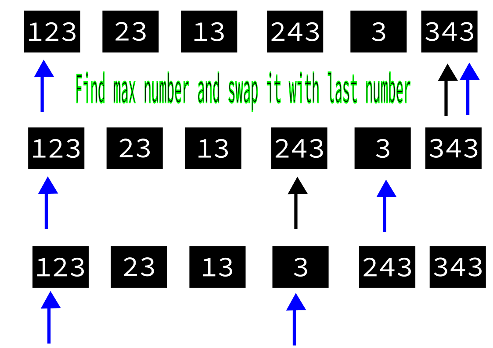
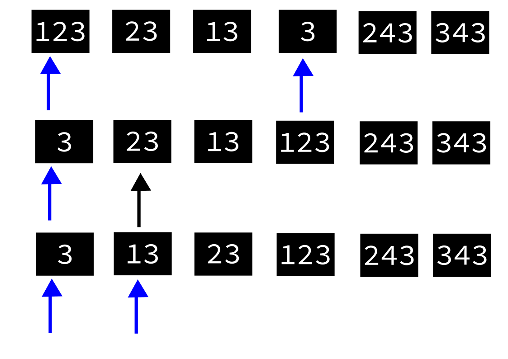
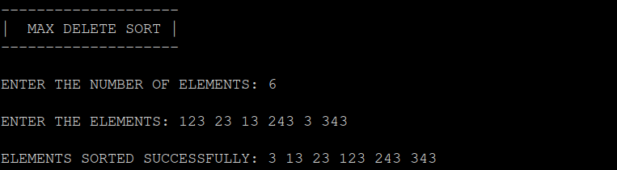

# MaxDeleteSort

MaxDeleteSort is an sorting algorithm written in c it sorts the elements(here numbers) based on there value.  
This process continued until the sorting is done and you get sorted numbers as output.

## HOW IT WORKS ?

It first finds the max number and swaps it with n-1 th element in the same array and variable pointing to last element is decremented.This process continued until the sorting is done.For more info check the output images.

### OUTPUT

