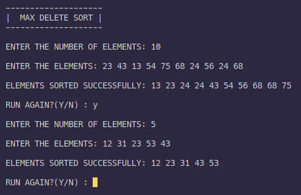

# MaxDeleteSort

MaxDeleteSort is an sorting algorithm written in c it sorts the elements(here numbers) based on there value.  
First you feed the unsorted numbers to it and it stores them into an array then it finds the maximum number and place it's into another array and the maximum number is changed to value 0.  
This process continued until the sorting is done and you get sorted numbers as output.

---

