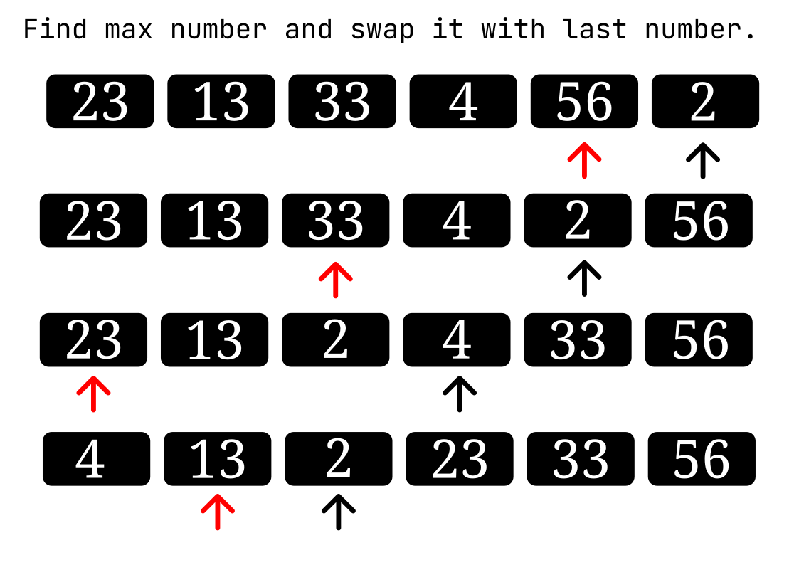
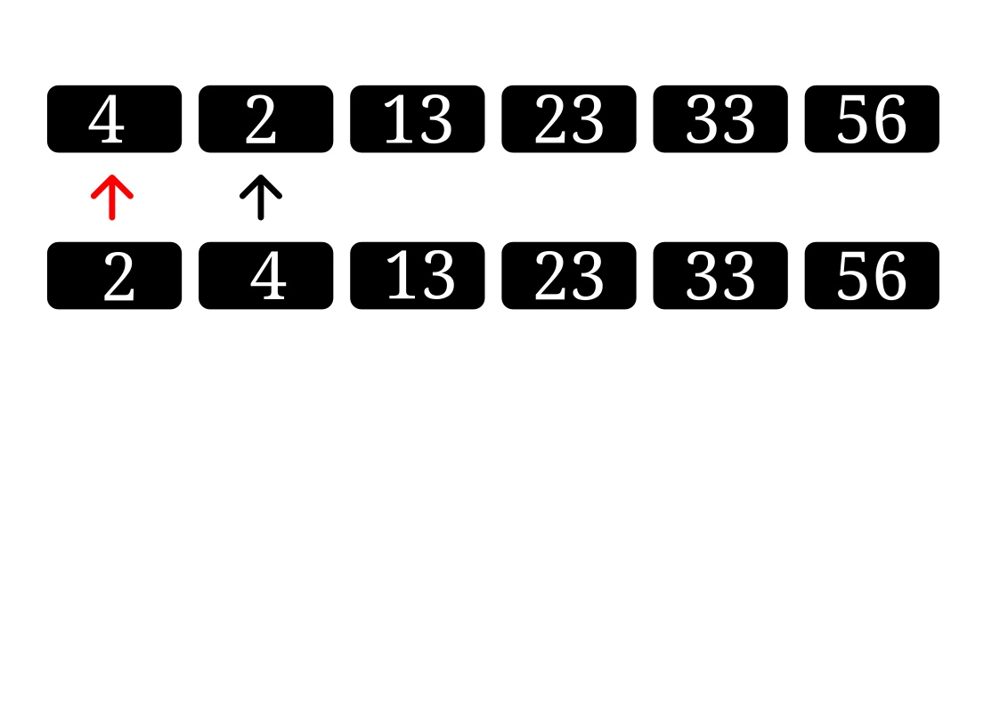
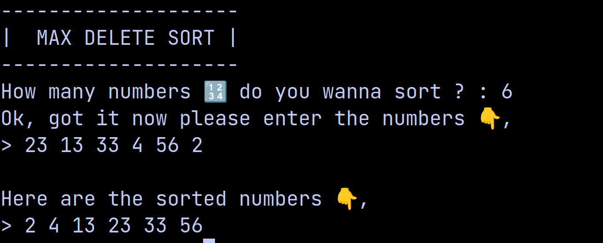

# MaxDelete Sort

This is the `insertion sort` but in reverse, created in **c** language.

---

## How it works?

It first finds the largest number in the array and then swaps it with the last number in the array, and this process is repeated until each number gets sorted.

---

## Output

